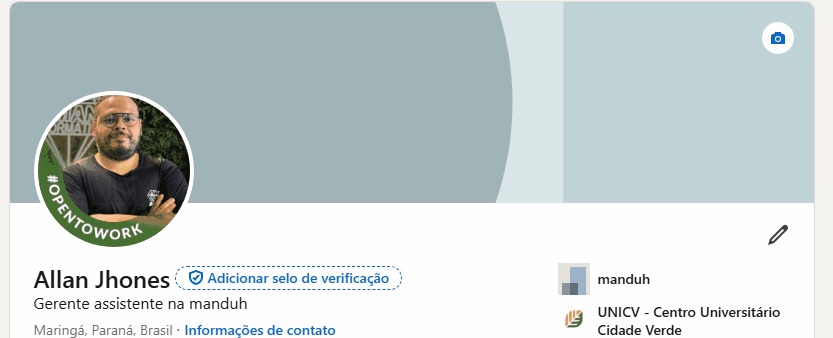

# Projeto com README
Um projeto de teste com um arquivo README✈

[](https://www.linkedin.com/in/allan-jhones-259ba724b/)

## Tecnologias Utilizadas
- HTML
- CSS
- ScreenToGif

## Como Utilizar

1 - Clone o projeto
```
git clone <url> do repositório de seu github
```

2 - Acesse a pasta do projeto
```
cd repositorio-com-readme + code . (no terminal)
```

3 - Acesse o site ScreenToGif
```
faça o Download e grave a tela que você quer que apareceça no gif demonstrativo, cole na pasta do projeto.
```

4 - Dentro do VSCODE use:
```
[]
" lembrando de que o meu estava salvo como exemplo.gif, então encontre o seu da forma que você nomeou e o anexe ao cod 
```
### Assim você tera um README fácil e simples de ser implementado 👍.

# OBRIGADO!